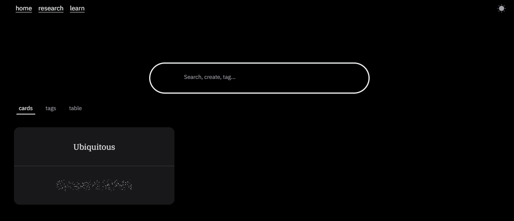

# Pitch

An AI-powered study and research app built with Next.js. Create and organize flashcards with tags, generate tag suggestions and research questions using LLMs, and review with a learning UI. The project follows the Feature-Sliced Design (FSD) architecture for scalable front-end structure.



## Table of Contents

-   [Overview](#overview)
-   [Key Features](#key-features)
-   [Tech Stack](#tech-stack)
-   [Architecture](#architecture)
-   [Getting Started](#getting-started)
    -   [Prerequisites](#prerequisites)
    -   [Installation](#installation)
    -   [Environment Variables](#environment-variables)
    -   [Run](#run)
-   [Usage](#usage)
    -   [Home](#home)
    -   [Research](#research)
    -   [Learn](#learn)
    -   [API Examples](#api-examples)
-   [Available Scripts](#available-scripts)
-   [Contribution](#contribution)
-   [License](#license)
-   [Acknowledgements](#acknowledgements)

## Overview

Pitch helps you research topics with AI-generated follow-up questions, turn insights into cards, manage tags, and review through a learning workflow. It uses OpenRouter-hosted models for streaming responses and a modern component stack for a smooth UX.

## Key Features

-   **AI deep research**: Streamed follow-up questions to refine your research direction using OpenRouter models.
-   **Flashcards**: Create, view, and organize cards; rich UI components for card display.
-   **Tags and filtering**: Assign tags to cards, generate tags with AI, and filter cards by selected tags.
-   **Learning session UI**: Card stack, show-answer interaction, and smooth animations.
-   **Search panel**: Filter and find cards quickly by tags and content.
-   **Dark/light theme**: Theme switching powered by next-themes and HeroUI.

## Tech Stack

-   **Framework**: [Next.js 15](https://nextjs.org/docs) (App Router, Server Actions)
-   **UI**: [HeroUI v2](https://heroui.com/), [Tailwind CSS v4](https://tailwindcss.com/), [Framer Motion](https://www.framer.com/motion/)
-   **Language**: [TypeScript](https://www.typescriptlang.org/)
-   **State**: [Zustand](https://github.com/pmndrs/zustand)
-   **AI**: [Vercel AI SDK](https://sdk.vercel.ai/) (`ai`, `@ai-sdk/react`), [OpenRouter provider](https://openrouter.ai)
-   **Validation**: [Zod](https://zod.dev)
-   **Lint/Format**: ESLint, Prettier, FSD lint rules

## Architecture

The project follows the Feature-Sliced Design (FSD) methodology with layers and strict import rules enforced by ESLint:

```
app → pages → widgets → features → entities → shared
```

-   **shared**: Reusable UI, lib, config, and styles (`src/shared/*`)
-   **entities**: Business entities like `card`, `tag`, and `ai` (`src/entities/*`)
-   **features**: Business capabilities such as card creation, interaction, tag management, AI questions (`src/features/*`)
-   **widgets**: Composite UI blocks such as cards list, learning session, search panel, navbar (`src/widgets/*`)
-   **pages**: Page-level composition and routing (`src/pages/*`)
-   **app**: App-level config, providers, and App Router API routes (`src/app/*` and root `app/*`)

## Getting Started

### Prerequisites

-   Node.js 18.18+ (recommended for Next.js 15)
-   pnpm 10+ (project uses `packageManager: pnpm@10.x`)

### Installation

```bash
pnpm install
```

If using pnpm with HeroUI, add to `.npmrc` to ensure correct hoisting:

```bash
public-hoist-pattern[]=*@heroui/*
```

Then re-install:

```bash
pnpm install
```

### Environment Variables

Create `.env.local` in the project root:

```bash
OPENROUTER_API_KEY=your_openrouter_api_key
```

The key is required by the AI integrations (`src/shared/ai/llm-models.ts`, `src/entities/ai/api/questions.ts`). You can obtain one from the OpenRouter dashboard.

### Run

Development server (Turbopack):

```bash
pnpm dev
```

Production build and start:

```bash
pnpm build
pnpm start
```

Lint and auto-fix:

```bash
pnpm lint
```

App will be available at `http://localhost:3000`.

## Usage

### Home

-   **Search and filter**: Use the search panel to filter cards by selected tags.
-   **Cards list**: View cards in a responsive grid.
-   **Create and manage**: Add new cards, edit content, and attach tags.

### Research

-   Ask a research question; the app streams concise follow-up questions to guide your investigation.
-   Uses a system prompt tailored for expert-level analysis and streamed responses for responsiveness.

### Learn

-   Review cards via a stack-based learning interface.
-   Reveal answers, cycle through cards, and refine knowledge.

### API Examples

The app exposes streaming AI endpoints under the App Router:

-   **POST** `/api/ai/questions` — stream follow-up questions for a topic

```bash
curl -N -X POST \
  -H "Content-Type: application/json" \
  -d '{"prompt":"Explain the impact of CRDTs on collaborative editing"}' \
  http://localhost:3000/api/ai/questions
```

-   **POST** `/api/ai/tags` — stream tag suggestions for provided content

```bash
curl -N -X POST \
  -H "Content-Type: application/json" \
  -d '{"prompt":"Front: Vector clocks\nBack: Tracks causality in distributed systems"}' \
  http://localhost:3000/api/ai/tags
```

Responses are streamed as text; use `-N` with `curl` to see incremental output.

## Available Scripts

-   `dev`: Start development server with Turbopack
-   `build`: Build the app
-   `start`: Start the production server
-   `lint`: Run ESLint with auto-fix and FSD rules

## Contribution

Contributions are welcome! To propose changes:

1. Fork the repository
2. Create a feature branch: `git checkout -b feat/your-feature`
3. Install dependencies and set up `.env.local`
4. Run `pnpm lint` and ensure no FSD rule violations
5. Commit with clear messages and open a Pull Request

For bug reports, please include steps to reproduce and relevant logs.

## License

This project is licensed under the MIT License. See `LICENSE` for details.

## Acknowledgements

-   [HeroUI](https://heroui.com/)
-   [Tailwind CSS](https://tailwindcss.com/)
-   [Vercel AI SDK](https://sdk.vercel.ai/)
-   [OpenRouter](https://openrouter.ai/)
-   [DeepSeek models](https://openrouter.ai/models/deepseek)
